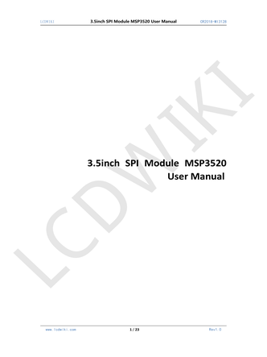

<h1 align="center">ILI9488 Driver MicroPython for 3.5" TFT SPI 320x480 V1.0 Display</h1>

<div align="center">
  
</div>

----

<div align="center">
  <table>
    <tr>
      <th colspan="3" align="center">Display Pins</th>
    </tr>
    <tr>
      <th>Display</th>
      <th>Touch</th>
      <th>SD Slot</th>
    </tr>
    <tr>
      <td>VCC</td>
      <td></td>
      <td></td>
    </tr>
    <tr>
      <td>GND</td>
      <td></td>
      <td></td>
    </tr>
    <tr>
      <td>CS</td>
      <td></td>
      <td></td>
    </tr>
    <tr>
      <td>RESET</td>
      <td></td>
      <td></td>
    </tr>
    <tr>
      <td>CS/RS</td>
      <td></td>
      <td></td>
    </tr>
    <tr>
      <td>SDI (MOSI)</td>
      <td></td>
      <td></td>
    </tr>
    <tr>
      <td>SCK</td>
      <td></td>
      <td></td>
    </tr>
    <tr>
      <td>LED</td>
      <td></td>
      <td></td>
    </tr>
    <tr>
      <td></td>
      <td>SDO (MISO)</td>
      <td></td>
    </tr>
    <tr>
      <td></td>
      <td>T_CLK</td>
      <td></td>
    </tr>
    <tr>
      <td></td>
      <td>T_CS</td>
      <td></td>
    </tr>
    <tr>
      <td></td>
      <td>T_DIN (MOSI)</td>
      <td></td>
    </tr>
    <tr>
      <td></td>
      <td>T_DO (MISO)</td>
      <td></td>
    </tr>
    <tr>
      <td></td>
      <td>T_IRQ</td>
      <td></td>
    </tr>
    <tr>
      <td></td>
      <td></td>
      <td>SD_CS</td>
    </tr>
    <tr>
      <td></td>
      <td></td>
      <td>SD_MOSI</td>
    </tr>
    <tr>
      <td></td>
      <td></td>
      <td>SD_MISO</td>
    </tr>
    <tr>
      <td></td>
      <td></td>
      <td>SD_SCK</td>
    </tr>
  </table>
</div>

----

<div>
  <h2>File estructure on the microcontroller</h2>
</div>

<div>
<pre>
&#x1F4DF; root microcontroller
&#x251C;&#x2500;&#x2500; &#x1F4C1;fonts (WE DON'T NEED ALL OF THEM)
&#x7C;   &#x251C;&#x2500;&#x2500; &#x1F4C4;vga1_8x8.py
&#x7C;   &#x2514;&#x2500;&#x2500; &#x1F4C4;vga1_8x16.py 
&#x7C;  
&#x251C;&#x2500;&#x2500; &#x1F4C4;ili9488.py
&#x251C;&#x2500;&#x2500; &#x1F4C4;set_display.py (from boards/YOUR_BOARD)
&#x251C;&#x2500;&#x2500; &#x1F4C4;example.py (from examples)
&#x2514;&#x2500;&#x2500; &#x1F4C4;image.bmp (from examples)
</pre>  
</div>

----

<div>
  <h2>Basic template code</h2>
</div>


````python
from ili9488 import driver, Color # Class driver and Color
import set_display # SPI Pins of your board
import fonts.vga1_16x16 as font # Only if you're going to write

# Set display connection and rotation 0=0º, 1=90º, 2=180ª, 3=270ª
lcd = set_display.setting(0) 

# Put a background color to the display or will be gray with scanlines
lcd.fill(Color.WHITE)

# Write text on screen
lcd.text("Luciano's tech", 0, 10, Color.RED, font, Color.PCYAN)
````

----


<h2>Class Color</h2>

<p>See the next table on the web <a href="https://pibsas.github.io/ILI9488_Driver_MicroPython/" target="_blank">README</a> version</p>

<div align="center">
  <table style="background-color:#F0F0F0;">
    <tr>
      <th colspan="3" align="center">CONSTANTS COLOR</th>
    </tr>
    <tr>
      <th>Color.{CONSTANT}</th>
      <th>RGB 565 HEX Code</th>
      <th>PREVIEW</th>
    </tr>
    <tr>
      <td>BLACK</td>
      <td>0x0000</td>
      <td style="background-color:#000000; width:40px; height:20px;"></td>
    </tr>
    <tr>
      <td>WHITE</td>
      <td>0xFFFF</td>
      <td style="background-color:#ffffff; width:40px; height:20px;"></td>
    </tr>
    <tr>
      <td>RED</td>
      <td>0xF800</td>
      <td style="background-color:#ff0000; width:40px; height:20px;"></td>
    </tr>
    <tr>
      <td>BLUE</td>
      <td>0x001F</td>
      <td style="background-color:#0000ff; width:40px; height:20px;"></td>
    </tr>
    <tr>
      <td>GREEN</td>
      <td>0x07E0</td>
      <td style="background-color:#00ff00; width:40px; height:20px;"></td>
    </tr>
    <tr>
      <td>CYAN</td>
      <td>0x07FF</td>
      <td style="background-color:#00ffff; width:40px; height:20px;"></td>
    </tr>
    <tr>
      <td>MAGENTA</td>
      <td>0xF81F</td>
      <td style="background-color:#ff00ff; width:40px; height:20px;"></td>
    </tr>
    <tr>
      <td>YELLOW</td>
      <td>0xFFE0</td>
      <td style="background-color:#ffff00; width:40px; height:20px;"></td>
    </tr>
    <tr>
      <td>ORANGE</td>
      <td>0xFD20</td>
      <td style="background-color:#ffa600; width:40px; height:20px;"></td>
    </tr>
    <tr>
      <td>PINK</td>
      <td>0xFE3F</td>
      <td style="background-color:#ffc6ff; width:40px; height:20px;"></td>
    </tr>
    <tr>
      <td>MAROON</td>
      <td>0x7800</td>
      <td style="background-color:#7b0000; width:40px; height:20px;"></td>
    </tr>
    <tr>
      <td>PURPLE</td>
      <td>0x780F</td>
      <td style="background-color:#7b007b; width:40px; height:20px;"></td>
    </tr>
    <tr>
      <td>OLIVE</td>
      <td>0x7BE0</td>
      <td style="background-color:#7b7d00; width:40px; height:20px;"></td>
    </tr>
    <tr>
      <td>GREENYELLOW</td>
      <td>0xAFE5</td>
      <td style="background-color:#adff29; width:40px; height:20px;"></td>
    </tr>
    <tr>
      <td>DARKGREEN</td>
      <td>0x03E0</td>
      <td style="background-color:#007d00; width:40px; height:20px;"></td>
    </tr>
    <tr>
      <td>DARKCYAN</td>
      <td>0x03EF</td>
      <td style="background-color:#007d7b; width:40px; height:20px;"></td>
    </tr>
    <tr>
      <td>DARKGREY</td>
      <td>0x7BEF</td>
      <td style="background-color:#7b7d7b; width:40px; height:20px;"></td>
    </tr>
    <tr>
      <td>LIGHTGREY</td>
      <td>0xC618</td>
      <td style="background-color:#c5c2c5; width:40px; height:20px;"></td>
    </tr>
    <tr>
      <td>PRED</td>
      <td>0xFD75</td>
      <td style="background-color:#ffaead; width:40px; height:20px;"></td>
    </tr>
    <tr>
      <td>PORANGE</td>
      <td>0xFEB4</td>
      <td style="background-color:#ffd7a5; width:40px; height:20px;"></td>
    </tr>
    <tr>
      <td>PGREEN</td>
      <td>0xCFF7</td>
      <td style="background-color:#ceffbd; width:40px; height:20px;"></td>
    </tr>
    <tr>
      <td>PYELLOW</td>
      <td>0xFFF6</td>
      <td style="background-color:#ffffb5; width:40px; height:20px;"></td>
    </tr>
    <tr>
      <td>PCYAN</td>
      <td>0x9FBF</td>
      <td style="background-color:#9cf7ff; width:40px; height:20px;"></td>
    </tr>
    <tr>
      <td>PBLUE</td>
      <td>0x9E1F</td>
      <td style="background-color:#9cc2ff; width:40px; height:20px;"></td>
    </tr>
    <tr>
      <td>PPURPLE</td>
      <td>0xBD9F</td>
      <td style="background-color:#bdb2ff; width:40px; height:20px;"></td>
    </tr>
    <tr>
      <td>TRED</td>
      <td>0xD945</td>
      <td style="background-color:#de2829; width:40px; height:20px;"></td>
    </tr>
    <tr>
      <td>TORANGE</td>
      <td>0xF384</td>
      <td style="background-color:#f77121; width:40px; height:20px;"></td>
    </tr>
    <tr>
      <td>TYELLOW</td>
      <td>0xF643</td>
      <td style="background-color:#f7ca19; width:40px; height:20px;"></td>
    </tr>
    <tr>
      <td>TGREEN</td>
      <td>0x7568</td>
      <td style="background-color:#73ae42; width:40px; height:20px;"></td>
    </tr>
    <tr>
      <td>TDARKGREEN</td>
      <td>0x03E9</td>
      <td style="background-color:#007d4a; width:40px; height:20px;"></td>
    </tr>
    <tr>
      <td>ALL</td>
      <td>A list with all constants</td>
      <td style="background-color:#000000; width:40px; height:20px;"></td>
    </tr>
    <tr>
      <td>rgb(red 5 bit,green 6 bit,blue 5 bits)</td>
      <td>Color.rgb(255,34,124)</td>
      <td style="background-color:#ff8aff; width:40px; height:20px;"></td>
    </tr>
  </table>
</div>


----


<div>
  <h2>Functions</h2>
</div>

<h3>Fill the screen with a color from class Color or hex:</h3>

````python
fill(color)
````


<h3>Draw a pixel:</h3>

````python
pixel(x, y, color)
````


<h3>Draw a character:</h3>

````python
char(x, y, ch, color, font, bg=None, scale=1)
````


<h3>Write text:</h3>

````python
text(text, x, y, color, font, bg=None, scale=1)
````


<h3>Draw a rectangle:</h3>

````python
rect(x, y, w, h, color)
````


<h3>Draw a rectangle optimized:</h3>

````python
fast_rect(x, y, w, h, color)
````


<h3>Draw a solid rectangle:</h3>

````python
fill_rect(x, y, w, h, color)
````


<h3>Draw an ellipse:</h3>

````python
ellipse(xc, yc, rx, ry, color)
````


<h3>Draw a solid ellipse:</h3>

````python
fill_ellipse(xc, yc, rx, ry, color)
````


<h3>Draw a line, horizontal, vertical or diagonal:</h3>

````python
line(x0, y0, x1, y1, color)
````


<h3>Draw an horizontal line:</h3>

````python
hline(x, y, length, color)
````


<h3>Draw an horizontal line optimized:</h3>

````python
fast_hline(x, y, length, color)
````


<h3>Draw a vertical line:</h3>

````python
vline(x, y, length, color)
````


<h3>Draw a vertical line optimized:</h3>

````python
fast_vline(x, y, length, color)
````


<h3>Draw a triangle:</h3>

````python
triangle(x1, y1, x2, y2, x3, y3, color)
````


<h3>Draw a solid triangle:</h3>

````python
fill_triangle(x1, y1, x2, y2, x3, y3, color):
````


<h3>Draw a polygon given a list of points and color:</h3>

````python
polygon(points, color)
````


<h3>Draw a solid polygon given a list of points and color:</h3>

````python
fill_polygon(points, color)
````


<h3>Draw a polygon given a variable list of points and color:</h3>

````python
var_polygon(*points, color)
````


<h3>Draw a regular polygon with angle rotation:</h3>

````python
regular_polygon(xc, yc, radius, sides, color, rotation=0)
````


<h3>Draw a solid regular polygon with angle rotation:</h3>

````python
fill_regular_polygon(xc, yc, radius, sides, color, rotation=0)
````


<h3>Draw a circle:</h3>

````python
circle(xc, yc, radius, color)
````


<h3>Draw a solid circle:</h3>

````python
fill_circle(xc, yc, radius, color)
````


<h3>Draw image buffer at x,y position:</h3>

````python
blit_buffer(buffer, x, y, width, height)
````


<h3>Show BMP image 1:1 :</h3>

````python
show_bmp(filename, x=0, y=0)
````


<h3>Show BMP image fitting on display:</h3>

````python
show_bmp_fit(filename)
````


<h3>Show BMP image stretching on display:</h3>

````python
show_bmp_stretch(filename)
````


<h3>Show BMP image choosing mode: None= 1:1, "fit", "stretch":</h3>

````python
bmp(filename, x=0, y=0, mode=None)
````


<h3>Select rgb color 565:</h3>

````python
Color.rgb(r, g, b)
````

----

<h2>Boards settings:</h2>

<ul>
<li><a href="boards/ESP32-C3 SUPER MINI" target="_blank">ESP32-C3 SUPER MINI</a></li>
<li><a href="boards/ESP32-S3 16MB PSRAM 8MB" target="_blank">ESP32-S3 16MB PSRAM 8MB</a></li>
<li><a href="boards/ESP32-WROOM-32D" target="_blank">ESP32-WROOM-32D</a></li>
<li><a href="boards/Raspberry Pi Pico" target="_blank">Raspberry Pi Pico</a></li>
<li><a href="boards/Raspberry Pi Pico W" target="_blank">Raspberry Pi Pico W</a></li>
<li><a href="boards/Raspberry Pi Pico 2" target="_blank">Raspberry Pi Pico 2</a></li>
<li><a href="boards/Raspberry Pi Pico 2W" target="_blank">Raspberry Pi Pico 2W</a></li>
<li><a href="boards/RP2040 16 MB" target="_blank">RP2040 16 MB</a></li>
<li><a href="boards/Waveshare ESP32-C3 Zero" target="_blank">Waveshare ESP32-C3 Zero</a></li>
<li><a href="boards/Waveshare ESP32-S3 Zero" target="_blank">Waveshare ESP32-S3 Zero</a></li>
<li><a href="https://github.com/PIBSAS/ILI9488_Driver_MicroPython/tree/main/boards" target="_blank">Boards files</a></li>
</ul>

----

<h2>Display's manual</h2>

<div>
<a href="https://github.com/PIBSAS/ILI9488_Driver_MicroPython/blob/main/docs/3.5inch_SPI_Module_MSP3520_User_Manual_EN.pdf" target="_blank" rel="noopener noreferrer">

</a>
</div>

----

<h2>Display's schematics</h2>

<div>
<a href="https://github.com/PIBSAS/ILI9488_Driver_MicroPython/blob/main/docs/3-5%20TFT%20SPI%20480x320%20V1-0%20Schematics.pdf" target="_blank" rel="noopener noreferrer">

</a>
</div>

----

<h2>ILI9488 Datasheet:</h2>

<div>
<a href="blob:https://github.com/f9bdcb31-0b26-48d4-a785-021d0f451256" target="_blank" rel="noopener noreferrer">

</a>
</div>

----

<h2>Waveshare ESP32 Getting started tutorials:</h2>

<div>
  <ul>
    <li><a href="https://docs.waveshare.com/ESP32-Tutorials-Intro" target="_blank">ESP32 Tutorials intro</a></li>
    <li><a href="https://docs.waveshare.com/ESP32-MicroPython-Tutorials" target="_blank">ESP32 MicroPython getting started</a></li>
  </ul>
</div>

----

<h2>Waveshare ESP32-S3 Zero:</h2>

<div>
  <ul>
    <li><a href="https://docs.waveshare.com/ESP32-S3-Zero" target="_blank">ESP32-S3-Zero</a></li>
  </ul>
  
</div>

----

<h2>Waveshare ESP32-C3 Zero:</h2>

<div>
  <ul>
    <li><a href="https://docs.waveshare.com/ESP32-C3-Zero" target="_blank">ESP32-C3-Zero</a></li>
  </ul>
  
</div>

----
