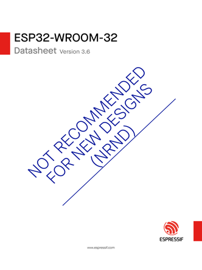
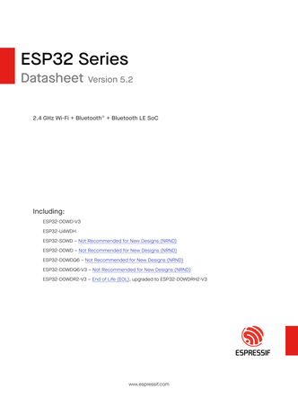
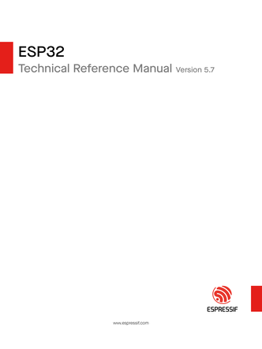

# ESP32 WROOM 32 Pinout:

  

  <ul>
    <a href="https://github.com/PIBSAS/ILI9488_Driver_MicroPython/blob/main/boards/ESP32%20WROOM%2032/esp32-wroom-32_datasheet_en.pdf" target="_blank">ESP32 WROOM 32 Datasheet</a>
     
    <a href="https://documentation.espressif.com/esp-dev-kits/en/latest/esp32/esp32-devkitc/user_guide_v2.html" target="_blank">ESP32 WROOM 32 Docs</a>
  </ul>

----

- SPI principal (`VSPI`) - `SPI_ID=2`

----

| Nombre normal |	Nombre en tabla	| Pin (No.)   	| Pin Name |
|---------------|-----------------|---------------|----------|
| CS/SS         |	VSPI CS	        | 23	          | GPIO  5  |
| MOSI/SDA/SDI	| VSPI MOSI       | 30	          | GPIO 23  |
| SCK/CLK	      | VSPI SCK        | 24	          | GPIO 18  |
| MISO/SDO      |	VSPI MISO       | 25	          | GPIO 19  |

----

# 3,5" TFT SPI 480x320 v1.0 ILI9488 Pinout:

| Nombre normal |	Nombre en tabla	| Pin (No.)	        | Pin Name |
|---------------|-----------------|-------------------|----------|
| MISO/SD0      |	VSPI MISO       | 25	              | GPIO 19  |
| LED           | ----------------| 10                | GPIO 27  |
| SCK/CLK	      | VSPI SCK        | 24	              | GPIO 18  |
| SDI/MOSI/SDA	| VSPI MOSI	      | 30	              | GPIO 23  |
| DC/RS         | ----------------|  8                | GPIO 25  |
| RESET         | ----------------|  9                | GPIO 26  |
| CS/SS         |	VSPI CS	        | 23	              | GPIO  5  |
| GND           | GND             | 14                | GND      |
| VCC           | 3V3             | 16                | 3V3      |

----

# SPI SD with MicroPython SDCard Class Pinout:

----

| Nombre normal |	Nombre en tabla	| Pin (No.)   	| Pin Name |
|---------------|-----------------|---------------|----------|
| SD_CS         |	HSPI CS	        | 18	          | GPIO 15  |
| SD_MOSI	      | HSPI MOSI       | 13	          | GPIO 13  |
| SD_MISO       |	GPIO 33         | 7 	          | GPIO 33  |
| SD_SCK        | HSPI CLK        | 11	          | GPIO 14  |

----

  <table>
    <tr>
      <td>
        
      </td>
      <td>
        
      </td>
    </tr>
  </table>

<h3>ESP32 WROOM-32 Datasheet:</h3>

    

<h3>ESP32 Series Datasheet:</h3>

    

<h3>ESP32 Technical Reference Manual:</h3>

    

