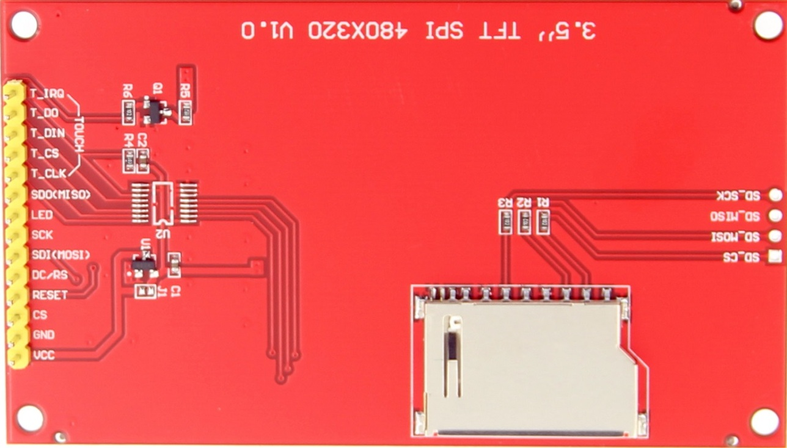

# Pins ESP32 S3:

- SPI principal (FSPI) - SPI_ID=1

| Nombre normal |	Nombre en tabla	| Pin J3 (No.)	| Pin Name |
|---------------|-----------------|---------------|----------|
| CS/SS         |	FSPICS0	        | 16	          | GPIO 10  |
| MOSI/SDA/SDI	| FSPID	          | 17	          | GPIO 11  |
| SCK/CLK	      | FSPICLK	        | 18	          | GPIO 12  |
| MISO/SDO      |	FSPIQ	          | 19	          | GPIO 13  |

# Pins 3,5" TFT SPI 480x320 v1.0 ILI9488:

| Nombre normal |	Nombre en tabla	| Pin J3 & J1 (No.)	| Pin Name |
|---------------|-----------------|-------------------|----------|
| MISO/SD0      |	FSPIQ	          | 19	              | GPIO 13  |
| LED           | ----------------| J1 =2             | 3V3      |
| SCK/CLK	      | FSPICLK	        | 18	              | GPIO 12  |
| SDI/MOSI/SDA	| FSPID	          | 17	              | GPIO 11  |
| DC/RS         | ----------------| 6                 | GPIO 6   |
| CS/SS         |	FSPICS0	        | 16	              | GPIO 10  |
| GND           | GND             | 1                 | GND      |
| VCC           | 3V3             | J1 = 1            | 3V3      |

  

    
  

  

    
  

