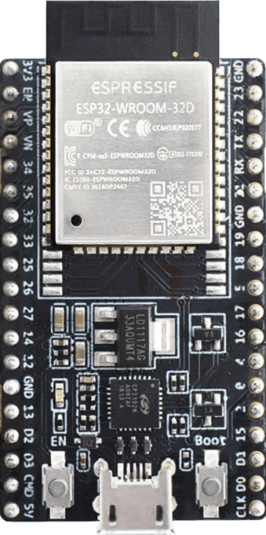

# ESP32-WROOM-32D Pinout:

  

  <ul>
  <a href="https://github.com/PIBSAS/ILI9488_Driver_MicroPython/blob/main/boards/ESP32-WROOM-32D/esp32-wroom-32d_esp32-wroom-32u_datasheet_en.pdf" target="_blank">ESP32-WROOM-32D Datasheet</a> 
  <a href="https://documentation.espressif.com/esp-dev-kits/en/latest/esp32/esp32-devkitc/user_guide.html" target="_blank">ESP32-WROOM-32D Docs</a>
  </ul>

----

- SPI principal (`FSPI`) - `SPI_ID=1`

----

| Nombre normal |	Nombre en tabla	| Pin (No.)   	| Pin Name |
|---------------|-----------------|---------------|----------|
| CS/SS         |	FSPICS0	        | 23	          | GPIO 15  |
| MOSI/SDA/SDI	| FSPID	          | 15	          | GPIO 13  |
| SCK/CLK	      | FSPICLK	        | 12	          | GPIO 14  |
| MISO/SDO      |	FSPIQ	          | 13	          | GPIO 12  |

----

# 3,5" TFT SPI 480x320 v1.0 ILI9488 Pinout:

| Nombre normal |	Nombre en tabla	| Pin (No.)	        | Pin Name |
|---------------|-----------------|-------------------|----------|
| MISO/SD0      |	FSPIQ	          | 13	              | GPIO 12  |
| LED           | ----------------| 26                | GPIO 4   |
| SCK/CLK	      | FSPICLK	        | 12	              | GPIO 14  |
| SDI/MOSI/SDA	| FSPID	          | 15	              | GPIO 13  |
| DC/RS         | ----------------| 27                | GPIO 16  |
| RESET         | ----------------| 28                | GPIO 17  |
| CS/SS         |	FSPICS0	        | 23	              | GPIO 15  |
| GND           | GND             | 38                | GND      |
| VCC           | 3V3             | 1                 | 3V3      |

----

  <table>
    <tr>
      <td align="center"><a href="https://github.com/PIBSAS/ILI9488_Driver_MicroPython/blob/main/boards/ESP32-WROOM-32D/esp32_devkitC_v4_pinlayout.png" target="_blank"></td>
      <td align="center"></td>
    </tr>
  </table>

