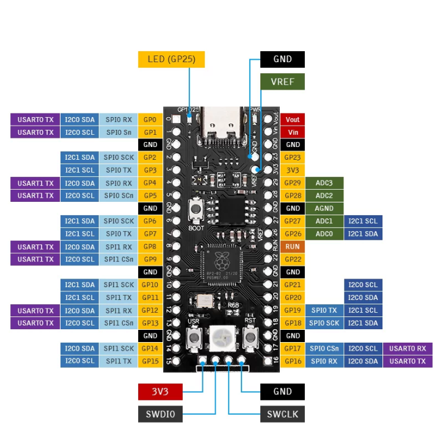

# YD-RP2040 16MB Pinout:

  

  <ul>
    <a href="https://github.com/PIBSAS/ILI9488_Driver_MicroPython/blob/main/boards/RP2040%2016%20MB/rp2040-datasheet.pdf" target="_blank">RP2040 Datasheet</a>
     
  </ul>

----

- SPI principal (`FSPI`) - `SPI_ID=1`

----

| Nombre normal |	Nombre en tabla	| Pin (No.)	    | Pin Name |
|---------------|-----------------|---------------|----------|
| CS/SS         |	SPI0 CSn        | 17	          | GPIO 13  |
| MOSI/SDA/SDI	| SPI1 TX         | 20	          | GPIO 15  |
| SCK/CLK	      | SPI1 SCK        | 19	          | GPIO 14  |
| MISO/SDO      |	SPI1 RX	        | 16	          | GPIO 12  |

----

# 3,5" TFT SPI 480x320 v1.0 ILI9488 Pinout:

| Nombre normal |	Nombre en tabla	| Pin (No.)       	| Pin Name |
|---------------|-----------------|-------------------|----------|
| MISO/SD0      |	SPI1 RX         | 16	              | GPIO 12  |
| LED           | --------------- | 37                | GPIO 23  |
| SCK/CLK	      | SPI1 SCK        | 19	              | GPIO 14  |
| SDI/MOSI/SDA	| SPI1 TX         | 20	              | GPIO 15  |
| DC/RS         | --------------- | 6                 | GPIO 6   |
| RESET         | --------------- | 7                 | GPIO 7   |
| CS/SS         |	SPI0 CSn        | 17	              | GPIO 13  |
| GND           | GND             | 3                 | GND      |
| VCC           | 3V3             | 36                | 3V3      |

----

  <table>
    <tr>
      <td>
        
      </td>
      <td>
        
      </td>
    </tr>
  </table>

