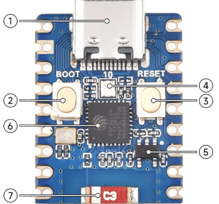
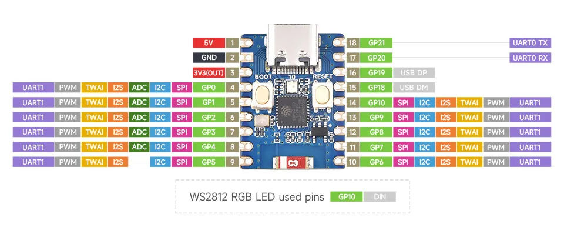

# Waveshare ESP32-C3 Zero Pinout:

  

  <ul>
  <a href="https://github.com/PIBSAS/ILI9488_Driver_MicroPython/blob/main/boards/Waveshare%20ESP32-C3%20Zero/esp32-c3_datasheet_en.pdf" target="_blank">ESP32 C3 Datasheet</a>
     
  <a href="https://docs.waveshare.com/ESP32-C3-Zero" target="_blank">Waveshare ESP32-C3 Zero Wiki</a>
  </ul>

----

- SPI principal (`FSPI`) - `SPI_ID=1`

----

| Nombre normal |	Nombre en tabla	| Pin (No.)    	| Pin Name |
|---------------|-----------------|---------------|----------|
| CS/SS         |	FSPICS0	        | 11 	          | GPIO 7   |
| MOSI/SDA/SDI	| FSPID	          | 13 	          | GPIO 9   |
| SCK/CLK	      | FSPICLK	        | 12 	          | GPIO 8   |
| MISO/SDO      |	FSPIQ	          | 9	            | GPIO 5   |

----

# 3,5" TFT SPI 480x320 v1.0 ILI9488 Pinout:

| Nombre normal |	Nombre en tabla	| Pin (No.)       	| Pin Name |
|---------------|-----------------|-------------------|----------|
| MISO/SD0      |	FSPIQ	          | 9 	              | GPIO 5   |
| LED           | ----------------| 4                 | GPIO 0   |
| SCK/CLK	      | FSPICLK	        | 12	              | GPIO 8   |
| SDI/MOSI/SDA	| FSPID	          | 13 	              | GPIO 9   |
| DC/RS         | ----------------| 10                | GPIO 6   |
| RESET         | ----------------| 6                 | GPIO 2   |
| CS/SS         |	FSPICS0	        | 11 	              | GPIO 7   |
| GND           | GND             | 2                 | GND      |
| VCC           | 3V3             | 3                 | 3V3 (OUT)|

----

  <table>
    <tr>
      <td>
        
      </td>
      <td>
        
      </td>
    </tr>
  </table>

<h3>ESP32 C3 Series Datasheet:</h3>

    

<h3>ESP32 C3 Technical Reference Manual:</h3>

    

