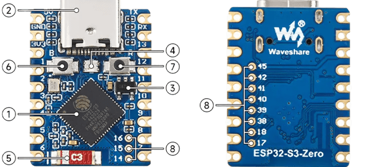
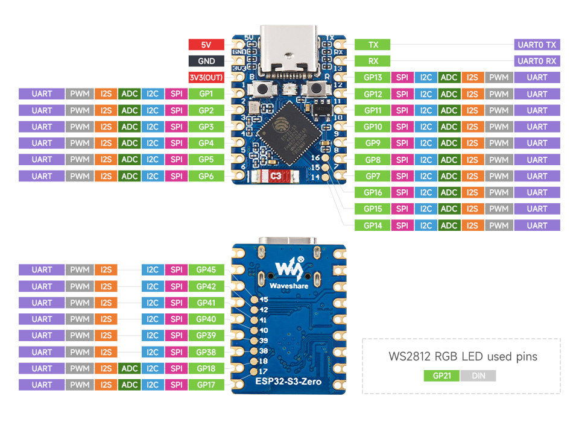

# Waveshare ESP32-S3 Zero Pinout:

  

  <ul>
  <a href="https://github.com/PIBSAS/ILI9488_Driver_MicroPython/blob/main/boards/Waveshare%20ESP32-S3%20Zero/esp32-s3_datasheet_en.pdf" target="_blank">ESP32 S3 Datasheet</a>
     
  <a href="https://docs.waveshare.com/ESP32-S3-Zero" target="_blank">Waveshare ESP32-S3 Zero Wiki</a>
  </ul>

----

- SPI principal (`FSPI`) - `SPI_ID=1`

----

| Nombre normal |	Nombre en tabla	| Pin J3 (No.)	| Pin Name |
|---------------|-----------------|---------------|----------|
| CS/SS         |	FSPICS0	        | 13	          | GPIO 10  |
| MOSI/SDA/SDI	| FSPID	          | 14	          | GPIO 11  |
| SCK/CLK	      | FSPICLK	        | 15	          | GPIO 12  |
| MISO/SDO      |	FSPIQ	          | 16	          | GPIO 13  |

----

# 3,5" TFT SPI 480x320 v1.0 ILI9488 Pinout:

| Nombre normal |	Nombre en tabla	| Pin (No.)	        | Pin Name |
|---------------|-----------------|-------------------|----------|
| MISO/SD0      |	FSPIQ	          | 16	              | GPIO 13  |
| LED           | ----------------|  8                | GPIO 5   |
| SCK/CLK	      | FSPICLK	        | 15	              | GPIO 12  |
| SDI/MOSI/SDA	| FSPID	          | 14	              | GPIO 11  |
| DC/RS         | ----------------|  9                | GPIO 6   |
| RESET         | ----------------| 10                | GPIO 7   |
| CS/SS         |	FSPICS0	        | 13	              | GPIO 10  |
| GND           | GND             |  2                | GND      |
| VCC           | 3V3             |  3                | 3V3(OUT) |

----

# SPI SD with MicroPython SDCard Class Pinout:

----

| Nombre normal |	Nombre en tabla	| Pin (No.)   	| Pin Name |
|---------------|-----------------|---------------|----------|
| SD_CS         |	GPIO 1	        |  4	          | GPIO 1   |
| SD_MOSI	      | GPIO 2          |  5	          | GPIO 2   |
| SD_MISO       |	GPIO 3          |  6	          | GPIO 3   |
| SD_SCK        | GPIO 4          |  7	          | GPIO 4   |

----

  <table>
    <tr>
      <td>
        
      </td>
      <td>
        
      </td>
    </tr>
  </table>

<h3>ESP32 S3 Series Datasheet:</h3>

    

<h3>ESP32 S3 Technical Reference Manual:</h3>

    

<h3>ESP32 S3 Hardware Design Guidelines:</h3>

    

